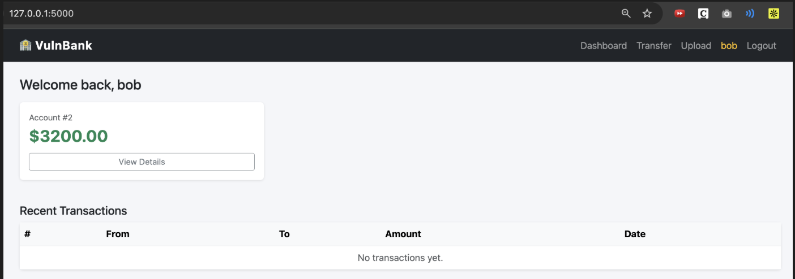

# VulnBank — Semgrep CI/CD Security Demo

A deliberately vulnerable Flask banking app demonstrating
how Semgrep catches security issues automatically in Jenkins.

## Vulnerabilities Demonstrated
- SQL Injection (login bypass) — app.py:112-116  
  query = (
      f"SELECT * FROM users WHERE username = '{username}' "
      f"AND password = '{hashed}'"
  )  
  user = db.execute(query).fetchone()  
  Username is concatenated directly into the SQL query. Payload like ' OR '1'='1' -- in the username field bypasses authentication.  
  
- IDOR (unauthorized account access) — app.py:141-143  
  account = db.execute(
      "SELECT * FROM accounts WHERE id = ?", (account_id,)
  ).fetchone()  
  No ownership check. Any logged-in user can visit /account/1, /account/2, etc. and see any account.  

- Command Injection (file upload) — app.py:226-231  
  result = subprocess.run(f"file {save_path}", shell=True, capture_output=True, text=True,)  
  The uploaded filename is embedded unsanitized into a shell command. A filename like foo; cat /etc/passwd executes arbitrary commands.  

- Hardcoded Secrets (admin credentials) — app.py:10-12                                                                                             
  app.secret_key = "supersecretkey123"                                                                                               
  ADMIN_USERNAME = "admin"                                                                                                            
  ADMIN_PASSWORD = "admin123"                                                                                                        
  Admin credentials and Flask session secret hardcoded in source.
  
- Weak Cryptography (MD5 password reset tokens) — app.py:249  
  token = hashlib.md5(username.encode()).hexdigest()  
  MD5 is cryptographically broken and deterministic — the token for alice is always the same and trivially reversible via rainbow
  tables.  
  
- Vulnerable Dependencies (CVE-XXXX-XXXX in requests) — requirements.txt:2  
  requests==2.18.0  
  Pinned to an old version with known CVEs (e.g. CVE-2018-18074 — credential exposure via redirect).  

## App Screenshots

---
### Jenkins setup
1. Start docker engine through Docker Desktop
2. pull container for jenkins: $ docker pull jenkins/jenkins
3. run container for jenkins: $ docker run -d --name jenkins -p 8080:8080 -p 50000:50000 -v jenkins_home:/var/jenkins jenkins/jenkins:latest

## What Semgrep Catches
[screenshot of Jenkins pipeline failure]
[screenshot of inline finding with exact line]

## The Pipeline
[diagram of Jenkins stages]

## Running Locally
